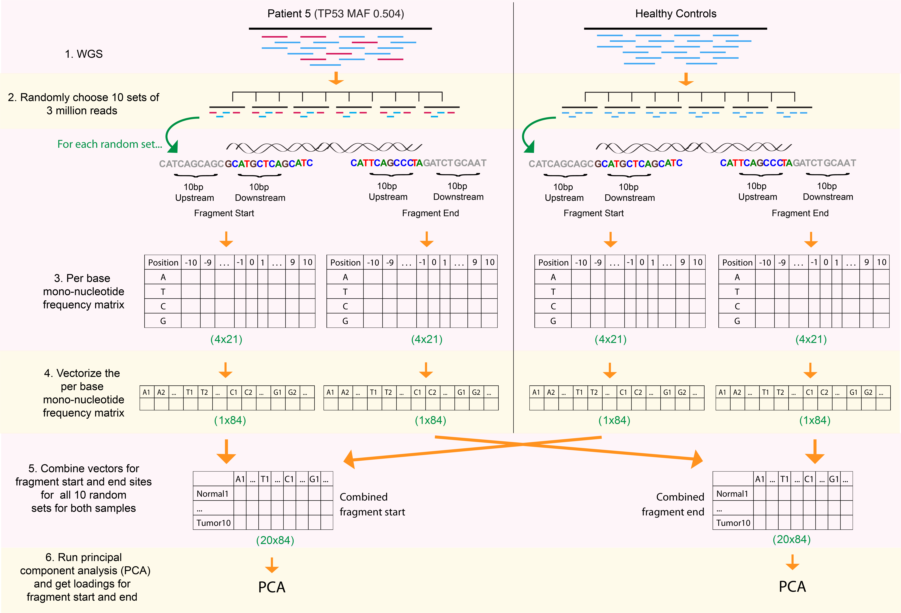

```{r setup, include=FALSE}
knitr::opts_chunk$set(echo = TRUE)
```

## Description 

* This document contains R code necessary to calculate per-base mono-, di-, and tri- nucleotide bias score (PBMNB-score, PBDNB-score, and PBTNB-score) for individual fragments respectively as described in the manuscript: Markus, Chandrananda, Moore, et al. **Refined characterization of circulating tumor DNA through biological feature integration** (2021). <doi: https://doi.org/10.1101/2021.08.11.21261907>
* The sections below give a step-by-step explanation of how to calculate the scores for example fragments using the pre-calculated PCA loadings from the manuscripts.

## Calculating PCA loadings

* 10 random bootstrap sets (RBS) of 3 million fragments was generated from both the pool of controls and HGSOC Patient 5.
* For each RBS the per-base mono-, di-, and tri- nucleotide frequency was calculated for regions -10bp and +10bp of fragment start and end sites respectively. These where summarized in a matrix where each row was one RBS and the columns were the per-base nucleotide frequencies. 
* Pricipal component analysis (PCA) was then carried out to calculate loadings of PC1 of fragment start and end per base mono-, di-, and tri- nucleotide frequency matrix.
* These steps are described in the image below.

<br>



<br>

* PC1 loading vector of mono-, di-, and tri- nucleotide frequency are provided in `loadings/pca_loadings.mono.start_end.RData`, `loadings/pca_loadings.di.start_end.RData` and `loadings/pca_loadings.tri.start_end.RData`
  * The provided vectors are concatenations on fragment start and end PC1 loadings.

## Calculating PBMNB-score, PBDNB-score, and PBTNB-score

* Given the PC1 loading vectors, the PBMNB-score, PBDNB-score, and PBTNB-score can be calculated for an individual fragment.
* For a fragment, two binary vectors are created that indicate whether a given mono-, di-, or tri- nucleotide motif is present at a given position of -10bp and +10bp of fragment start and end sites respectively.
* The fragment start and end vectors are concatenated together, and dot product is taken with the PC1 loading vector to get the PBMNB-score, PBDNB-score, and PBTNB-score.
* These steps are described in the image below.

<br>


<br>

## Example script

* The script below will be used to calculate the PBMNB-score, PBDNB-score, and PBTNB-score for 49 example cfDNA fragments given the DNA sequence -10bp and +10bp of fragment start and end sites respectively.
* The sequence of these fragments are provided in `sequences/start_seq.RData` and `sequences/end_seq.RData`
* The script also requires an empty frame of per-base di- and tri- nucleotide frequency that will ensure the PC1 loading association with each motif at a given position match motif and position of the given fragment. These are provided in `sequences/empty_diNuc_perBase.RData` and `sequences/empty_triNuc_perBase.RData` 

### Load required packages
```{r load_packages, warning=FALSE, message=FALSE}
library(dplyr)
library(data.table)
library(foreach)
```

### Load the data

```{r load_data, warning=FALSE, message=FALSE}
output_RData_file <- "/Users/hmarkus/Desktop/Thesis_Cambridge/AfterThesis/PBTNB_score"
load("loadings/pca_loadings.mono.start_end.RData") ## cont_pca_loadings_mono_start_end
load("loadings/pca_loadings.di.start_end.RData") ## cont_pca_loadings_di_start_end
load("loadings/pca_loadings.tri.start_end.RData") ## cont_pca_loadings_tri_start_end

load("sequences/empty_diNuc_perBase.RData") ## empty_diNuc_perBase
load("sequences/empty_triNuc_perBase.RData") ## empty_triNuc_perBase

load("sequences/start_seq.RData")
load("sequences/end_seq.RData")

## fragment start sequences
start_seq %>% head()
## fragment end sequences
end_seq %>% head()
```

### Calculate score

* The for loop in the code below with loop through each fragment to calculate its PBMNB-score, PBDNB-score, and PBTNB-score 
* `mono_start` contains the binary vector that summarizes whether a given mono-nucleotide motif is present at a given position of -10bp and +10bp of fragment start site.
* `mono_end` contains the binary vector that summarizes whether a given mono-nucleotide motif is present at a given position of -10bp and +10bp of fragment end site.
* `double_binary_start` contains the binary vector that summarizes whether a given di-nucleotide motif is present at a given position of -10bp and +10bp of fragment start site.
* `double_binary_end` contains the binary vector that summarizes whether a given di-nucleotide motif is present at a given position of -10bp and +10bp of fragment end site.
* `triple_binary_start` contains the binary vector that summarizes whether a given tri-nucleotide motif is present at a given position of -10bp and +10bp of fragment start site.
* `triple_binary_end` contains the binary vector that summarizes whether a given tri-nucleotide motif is present at a given position of -10bp and +10bp of fragment end site.

```{r calc_score}
score_frame <- foreach(iFrag = 1:length(start_seq), .combine = "rbind") %do% {
  
  ## A C G T
  mono_start <- Biostrings::consensusMatrix(Biostrings::DNAStringSet(start_seq[iFrag]), baseOnly=T,as.prob = T)[-5,] %>%
    t() %>% melt() %>% dplyr::select(value) %>% unlist()
  
  mono_end <- Biostrings::consensusMatrix(Biostrings::DNAStringSet(end_seq[iFrag]), baseOnly=T,as.prob = T)[-5,] %>%
    t() %>% melt() %>% dplyr::select(value) %>% unlist()
  
  mono_score <- c(mono_start, mono_end) %*% cont_pca_loadings_mono_start_end
  
  ## AA AC AG AT CA CC CG CT GA GC GG GT TA TC TG TT
  split_nuc <- start_seq[iFrag] %>% as.character() %>% strsplit(split = "") %>% unlist()
  split_dinuc <- paste0(split_nuc[1:(length(split_nuc)-1)], split_nuc[2:length(split_nuc)])
  split_dinuc <- data.frame(Var1=split_dinuc, Var2 = paste0("result.", 1:length(split_dinuc)), Var3=1) %>% plyr::join(empty_diNuc_perBase, ., by = c("Var1", "Var2"))
  split_dinuc$Var3[is.na(split_dinuc$Var3)] <- 0
  double_binary_start <- split_dinuc$Var3
  
  split_nuc <- end_seq[iFrag] %>% as.character() %>% strsplit(split = "") %>% unlist()
  split_dinuc <- paste0(split_nuc[1:(length(split_nuc)-1)], split_nuc[2:length(split_nuc)])
  split_dinuc <- data.frame(Var1=split_dinuc, Var2 = paste0("result.", 1:length(split_dinuc)), Var3=1) %>% plyr::join(empty_diNuc_perBase, ., by = c("Var1", "Var2"))
  split_dinuc$Var3[is.na(split_dinuc$Var3)] <- 0
  double_binary_end <- split_dinuc$Var3
  
  di_score <- c(double_binary_start, double_binary_end) %*% cont_pca_loadings_di_start_end
  
  ## AAA AAC AAG AAT ACA ACC ACG ACT AGA AGC AGG AGT ATA ATC ATG ATT CAA CAC CAG CAT CCA CCC CCG CCT CGA CGC CGG CGT CTA CTC CTG CTT GAA GAC ... TTT
  split_nuc <- start_seq[iFrag] %>% as.character() %>% strsplit(split = "") %>% unlist()
  split_trinuc <- paste0(split_nuc[1:(length(split_nuc)-2)], split_nuc[2:(length(split_nuc)-1)], split_nuc[3:length(split_nuc)])
  split_trinuc <- data.frame(Var1=split_trinuc, Var2 = paste0("result.", 1:length(split_trinuc)), Var3=1) %>% plyr::join(empty_triNuc_perBase, ., by = c("Var1", "Var2"))
  split_trinuc$Var3[is.na(split_trinuc$Var3)] <- 0
  triple_binary_start <- split_trinuc$Var3
  
  split_nuc <- end_seq[iFrag] %>% as.character() %>% strsplit(split = "") %>% unlist()
  split_trinuc <- paste0(split_nuc[1:(length(split_nuc)-2)], split_nuc[2:(length(split_nuc)-1)], split_nuc[3:length(split_nuc)])
  split_trinuc <- data.frame(Var1=split_trinuc, Var2 = paste0("result.", 1:length(split_trinuc)), Var3=1) %>% plyr::join(empty_triNuc_perBase, ., by = c("Var1", "Var2"))
  split_trinuc$Var3[is.na(split_trinuc$Var3)] <- 0
  triple_binary_end <- split_trinuc$Var3
  
  tri_score <- c(triple_binary_start, triple_binary_end) %*% cont_pca_loadings_tri_start_end
  
  return_frame <- data.frame(PBMNB.score = mono_score, PBDNB.score = di_score, PBTNB.score = tri_score)
  
  return(return_frame)
}

```

* Looking at the distribution of the PBTNB-score

```{r plot_score}
head(score_frame)

plot(density(score_frame$PBTNB.score), main = "PBTNB.score")
```


